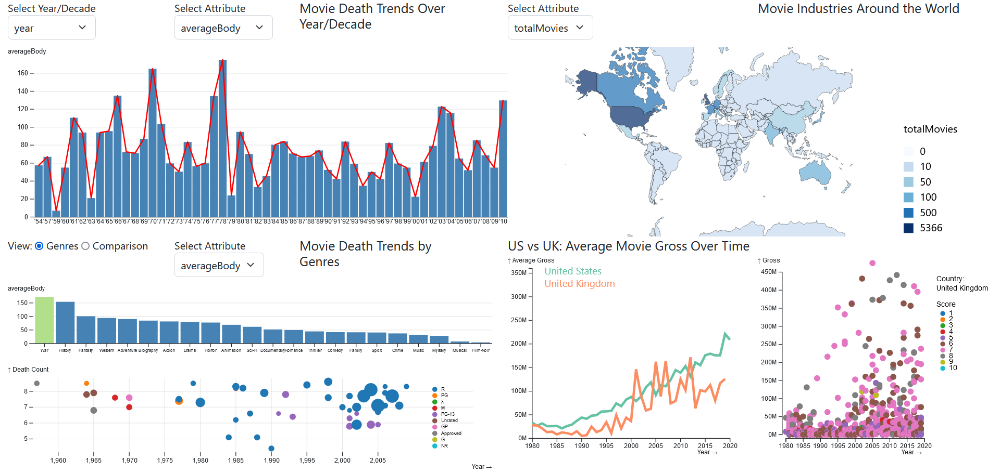

# CS 424 Project 3 : Movie Body Counts and the Movie Industry
Md Nafiul Nipu and Farah Kamleh

# Introduction

Project 3 for CS 424 includes visualizations created for Project 2 as well as two new visualizations: a linked spatial view and a multi-linkew view between a line chart and a scatter plot. For reference, Project 2 focused on analyzing movie body counts through the use of a csv file titled, ["filmdeathcounts.csv"](https://figshare.com/articles/dataset/On_screen_movie_kill_counts_for_hundreds_of_films/889719). The Observable Notebook containing the code and documenting each step of the exploratory process can be found [here](https://observablehq.com/d/beaf832cb432215a). Project 3, on the other hand, focuses on the movie industry in general using [Kaggle's Movie Industry](https://www.kaggle.com/datasets/danielgrijalvas/movies) dataset. It places heavy emphasis on countries and gross revenue.

# Webpage

The interactive visualizations generated for both Project 2 and Project 3 are hosted on [this webpage](https://nafiul-nipu.github.io/cs424-final-project/). The two on the left of the page are those from Project 2. Selecting the Comparison View reveals an additional visualization from the project. The two on the right, on the other hand, are the two new visualizations developed for Project 3.

  

# Data Description - Project 2

The data contained within the aforementioned csv file has been provided by the [Movie Body Counts](http://www.moviebodycounts.com/) website. It is a collection of on-screen body counts (i.e., on-screen kills) for 545 films from 1949 to 2013; therefore, it should be noted that a selection bias can be assumed.

  

As shown in the image above, the dataset contains 545 rows, each representing a film, and 8 columns. The attributes included in the columns are as follows: Film, Year, Body_Count, MPAA_Rating, Genre, Director, Length_Minutes, and IMDB_Rating. No filtering has been performed, as there are no null values in the dataset.

# Data Description - Project 3

The movie industry dataset provided by Kaggle contains 7425 movies from 1980 to 2020. As shown in the image below, it contains 7425 rows, each representing a film, and 9 columns. The attributes included in the columns are as follows: name, rating, genre, year, score, votes, country, gross, and runtime.

  

For our own purposes, the data has been manipulated and used to calculate additional useful information such as the average gross per country and average gross per year for each country.

# Visualization 1 - Top Left

## Questions

The first interactive visualization intends to answer the following questions:

* Did the number of on-screen deaths increase over the years?
* Did the movie industry become more violent over the years?

The attributes being used are Year, Body_Count, Length_Minutes, and IMDB_Rating.

## Visual Encodings and Interactions

  

  

As shown in the image above, the first visualization is a multi-linked view of a bar chart and a line chart. The y-axes and x-axes change according to the selection of the user. The top left provides a dropdown that offers to display either the exact years or the decades on the x-axis. The dropdown on the right, on the other hand, offers the user many attribute selections for the y-axis: averageBody, body_count, average_length, averageRating, and total_film. These selections help visualize the trends of the selected attribute over the years.

  

The last interactive part of the visualization is the ability to hover the mouse over a specific bar on the bar chart and display additional information about it depending on the attribute selection. For example, when having selected year and averageBody in the dropdowns, the information provided is the year, the average body count, the total films, and the total body count.

## Findings

  

As demonstrated by the image above, it can be concluded that early films from 1958 to 1978 had more on-screen deaths on average. Although on-screen deaths decreased in between, a rise can be observed in recent years from 2000 to 2010. Lastly, when visualized by decade like in the image below, a rise occurs in the 1960s followed by a decline from the 1970s to the end of the 1990s. In the 2000s, a rise is experienced again.

  

# Visualization 2 - Bottom Left Genres View

## Questions

The second interactive visualization intends to answer the following questions:

* Which genre has the most on-screen deaths?
* What is the distribution of movies based on each genre?

The attributes being used are Genre, Body_Count, Film, Year, MPAA Rating, and IMDB_Rating.

## Visual Encodings and Interactions

  

  

As shown in the image above, the second visualization is a co-coordinated multi-linked view of a bar chart and a scatter plot. The x-axis of the bar chart is genre while the y-axis is selected by the user using the dropdown menu at the top left. The options are averageBody, body_count, and total_film. Hovering over each bar displays additional information, mainly the exact numbers that cannot be accurately determined from the bars alone.

  

Using the mouse to click on a bar will change its color to green, resulting in a display of the associated scatter plot underneath. Its x-axis is the year and its y-axis is IMDB ratings. Each circle is a  film based on the genre selected using the bar chart. The size of the circles are mapped according to the number of body counts and circles are colored according to the MPAA ratings. The legend in the bottom left corner makes clear which MPAA rating is mapped to which film, as they are color-coded. Hovering the mouse over a single rating, such as R, causes only those that are rated R to remain at full opacity; the rest are filtered and made transparent. Hovering the mouse over the data points, on the other hand, displays additional information about the films themselves such as the film name, the year, the IMDB rating, and the body count.

  

## Findings

  

  

From the above figure, it can be noted that genre war has the highest number of average body count per movie. However, the number of movies are very low compared to other genres. The result is correct as war movies tend to have large number of on-screen deaths. 

<!-- biography movies -->
Biography is ranked number 6 in terms of average body count, which is surprising. Looking at the scatter plot reveals that movies like Schindler's list, Braveheart etc have the highest number of on-screen kills that made Biography ranking higher. 
Another interesting finding is - even though Lord of Rings: Return of the King is rated as PG-13, it has the highest number of on-screen death. 

# Visualization 3 - Bottom Left Comparison View

## Questions

The third interactive visualization intends to answer the following questions:

* Is there an observable correlation between the number of on-screen deaths and the IMDB ratings? For example, are films with high ratings those with a large number of on-screen deaths?
* What is the correlation between the aforementioned numerical attributes and MPAA ratings? Do the films with high numbers of on-screen deaths have MPAA ratings of R, X, and M? Likewise, do films with low numbers of on-screen deaths have MPAA ratings of G, PG, and PG-13?
* Does MPAA rating affect IMBD ratings? For example, do films that are rated more suitable for adult/mature audiences have higher IMDB scores than those rated more suitable for younger audiences?

With three in total, the attributes in question for the third visualization are Body_Count, IMDB_Rating, and MPAA_Rating. It is interactive and has multiple views.

## Visual Encodings and Interactions

  

  

As shown in the image above, the third visualization is a multi-linked view of a scatter plot and a donut chart. The y-axis label of the scatter plot is Body Count and its x-axis label is IMDB Rating. The user can select a subset of the data visualized using a movable brush; afterwards, the donut chart underneath it will update accordingly, displaying information for only the subset selected.

  

Hovering the mouse over a data point on the scatter plot will reveal information about the data point in question. The information displayed is the name of the film, the year of release, the total body count, the IMDB rating, and, finally, the MPAA rating. Doing so also lowers the opacity of the dot in order to make clear to the user which dot is being selected.

  

Similarly, hovering the mouse over a specific arc of the donut chart reveals information pertaining to it such as the MPAA rating, the total count of said rating, and its percentage represented of the whole area selected. The legend, presented in the center of the donut chart, makes clear which color is associated with which MPAA rating; the color-coding is present in both the arcs of the donut chart and the dots of the scatter plot.

## Findings

  

As shown in the image above, there is an observable climb in which films with high body counts receive high IMDB ratings and films with low body counts receive low IMDB ratings. However, the most notable takeaway is from the large gathering of data points at the bottom of the scatter plot. From the gathering comes the conclusion that there are more films with deaths below 100 in numbers and they usually have ratings between 5 and 9.

  

Using the brush tool to make a selection above 100 body counts, it can be determined from the donut chart that 60.5% of the films with body counts over 100 are rated R while 0.84% are rated G. Selecting the right side of the scatter plot with IMDB ratings of at least 8, it can be determined that 62.12% of the films with an IMDB rating of 8 or above are rated R while 1.52% are rated X.

# Visualization 4 - Top Right

## Questions

The fourth interactive visualization, which is a spatial view, intends to answer the following questions:

* Which country's movie industry releases the most movies?
* Which country's average IMDb score is highest?
* Which country has the highest average gross?
* Which country has the longest average runtime?

Taking advantage of the data available, the averages were calculated using four attributes: score, country, gross, and runtime.

## Visual Encodings and Interactions

The fourth visualization, found at the top right of the webpage, is a spatial view that displays information regarding movie industries around the world. It provides a dropdown menu for the user to select one of four attributes to change the visualization: totalMovies, avgRating, avgGross, and avgRuntime.

  

The legend at the right uses a blue hue that increases in intensity for the larger values. Hovering the mouse over a country "highlights" that country and reveals additional information. For example, in the image above, it reveals the average gross of the United States which is 90,000,000. The user can also pan around the map by clicking and dragging while also being able to zoom using the wheel of their mouse.

  

It should be noted that the spatial view is also a linked view. Selecting a country on the map changes the points on the scatter plot of the fifth and final visualization. In the image above, China has been selected. The scatter plot now displays all the films released in China that are included in the dataset.

## Findings

With the darkest blues, it can be determined by the spatial view that the United States and the United Kingdom have the greatest number of total movies which are 5,400 and 790 respectively. Regarding the highest average rating, many countries' average IMDb scores range between 6.1 and 7.7. In terms of average gross, China and Finland are highest with 220,000,000 and 170,000,000 respectively. Lastly, the average runtime is highest for India.

# Visualization 5 - Bottom Right

## Questions

## Visual Encodings and Interactions

## Findings